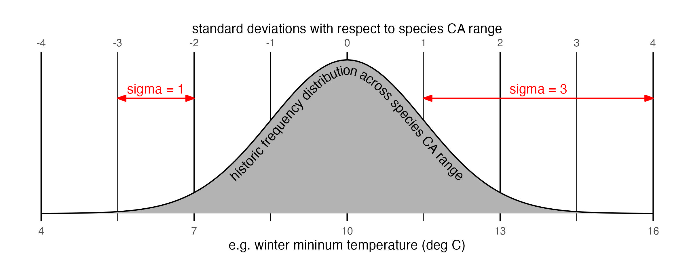

#### BACKGROUND:

The Seeds of Change tool is designed to help inform ecological management activities including matching the environments of seed provenancing and planting sites under predicted climate change, collecting material from diverse environments for seed banking or restoration efforts, and assisting gene flow in the face of climate change. The tool integrates data on plant species distributions, past and projected future climates, and soil characteristics.

The core function of the Seeds of Change tool is to measure the environmental similarity between a focal site (either a location where plant material was collected, or where it will be planted) and other sites across the range of a given plant species, typically spanning two points in time. It also performs environment-based cluster analyses to estimate seed zones within a species' range. Users can explore how these results change under different model settings, such as alternative climate change scenarios, the relative importance of soil versus climate to a species, and the spatial scale of population genetic adaptation to the local environment.

The basic rationale for localized environmental information being relevant to management questions like these is the assumption that plant populations are genetically adapted to the historic environment of the locations where they live. Research suggests that populations often, but by no means always, exhibit true "local adaptation" meaning they exhibit better performance in their local environments than in other environments across the species range. Even in the absence of proper local adaptation, plants do of course at least have a demonstrated ability to survive on some timescale in the locations where they are found, which implies that understanding patterns of climate departure from these historic conditions can help to inform vulnerability assessments.

To estimate the environment that a plant population inhabits and may be adapted to, we must define a "population." Biologically, the spatial scale of populations will depend on the rates of seed and pollen movement among nearby sites, relative to the rate of natural selection within a site: populations with strong selection and limited movement may be highly adapted to their local microenvironment, whereas populations with substantial seed and pollen movement relative to local selection may instead be adapted to the average environment across a larger swath of the species range. This tool uses spatial "smoothing" filters to approximate different scales of local adaptation.

The instructions below provide a brief overview of usage. The **[?]** symbols found throughout the app also provide information about individual settings and variables. See the [technical documentation](seeds-of-change-technical-documentation.pdf) for more details on the underlying data and methods.

------------------------------------------------------------------------

#### USE CASES:

This tool can be used to inform a variety of interrelated management activities, including:

-   ***Predictive provenancing***: The goal of predictive provenancing is to choose where across a species range to collect seeds to plant in a given restoration site, often by analyzing spatial environmental patterns to estimate which populations may be relatively more adapted to the environment of the planting site. In the Seeds of Change tool, setting the focal location to the restoration site, the focal activity to "planting," and the display variable to "environmental difference" will visualize how similar the historic environments of sites across a species range are to the future environment of the restoration site. Sites with more similar environments are hypothesized to be more suitable as seed collection locations.

-   ***Predictive planting***: The inverse of predictive provenancing, the goal of predictive planting is to choose where to plant seeds that have been collected from a particular site. Setting the focal location to the known collection site, the focal activity to "seed collection," and the display variable to "environmental difference" will visualize how similar the future environments of sites across a species range are to the historic environment of the collection site. Sites with more similar environments are hypothesized to be more suitable as planting locations.

-   ***Assisted gene flow and assisted migration***: These controversial managed relocation practices involve helping species overcome dispersal limitation in the face of climate change-driven fitness declines, by moving plant material to more suitable sites within or beyond their current ranges, respectively. They involve similar data considerations to the above two practices, but with a broader species-level conservation focus. The Seeds of Change tool can help inform these activities by matching seed collection and planting sites within a species range, and by using the scatter plot to understand predicted climate change at a given focal site in the context of climate variation across the species entire California range, which could be an indication of the species-level climatic niche. Assisting gene flow involves managing both inbound dispersal of beneficial alleles into a given population that needs rescuing, and outbound dispersal of unique alleles that need rescuing; these cases are addressed by the "seed collection" and "planting" modes in the tool, respectively. Assisting migration involves outbound relocation of a species to sites outside its current range; while controversial due to the potential ecological risks it carries, it can be explored by deselecting the "limit results to species range" option when the activity is set to "seed collection."

-   ***Climate vulnerability analysis***: The app can be used in multiple ways go get insight into which parts of a species range may be more vulnerable to future climate change. It can display maps of climate change exposure, i.e. the amount of climate change at each site across the reagion, for individual climate variables. It also includes a species-specific "multivariate climate change" metric that combines the amount of projected change in all five climate variables in each grid cell, normalized by the species' realized niche breadth in California. For individual focal sites, the default "environmental difference" output variable provides insight into vulnerability when activity is set to "planting"; sites with higher vulnerability will have fewer and/or more distant areas with low environmental difference values. Finally, the scatter plot also illustrates climate change at the focal site (arrows) relative to climate variation across the species range (points), which can be used to visualize whether a given site is projected to remain within the species' realized climatic niche as climate changes or is expected to unlike any conditions the species inhabits in California.

-   ***Admixture provenancing and seed banking***: A separate category of seed collection strategies aims to source seeds from populations across the species range that encompass a wide diversity of different environments, with the goal of maximizing the diversity of adaptive genetic variation that is sampled. The predictive "seed zones" output is designed to support these efforts, by running an environmental cluster analysis on sites across the species range to identify zones that are as internally homogeneous, and as distinct from other zones, as possible. Clustering can be done using past or future climate and/or soil data, and with varying scales of spatial smoothing applied.

-   ***Stratified sampling***: Beyond informing seed collection efforts, the tool can also be used to inform other activities that require stratifying by or controlling for environmental variation across a species range, such as establishing sites for field surveys or genetic sampling.

------------------------------------------------------------------------

#### SETTING MODEL INPUTS:

The model settings are grouped into a "species" tab that includes parameters related to the species biology, and a "context" tab that includes settings related to the context of the analysis. These options can be set based on the particulars of your species and use case, or they can be iteratively changed to explore the sensitivity of outputs to these choices. Each time a setting is changed, results are recomputed and displayed on the map and scatter plot in the results panel.

1.  To get started, select a ***species***. This will load a map of the modeled range of the species. Additional species-focused settings on this tab include the ***SDM threshold*** determining the narrowness of the range map, the ***smoothing radius*** defining the scale of environmental smoothing applied to the historic data, and the relative weight assigned to ***soil versus climate*** variables.

2.  Next, select a focal site ***location*** by clicking the map or entering a longitude and latitude in the input box. Also use the dropdown to select the ***focal site activity***, i.e. whether the focal site is a planting or collection location (if it's a collection site, it must be a location within the species range shown on the map). Additional options include the future ***time period*** and emission ***scenario***, which determine the climate data used to assess planting sites.

3.  Finally, the tool includes a range of alternative ***display variables*** to plot in color on the map and scatter plot. These are described in the next section below.

------------------------------------------------------------------------

#### INTERPRETING RESULTS:

Results for a given set of model inputs are displayed on the map and scatter plot.

Users can pan and zoom to explore the map. The scatter plot has a point for every 1 km grid cell on the map, showing how these locations are distributed across environmental space; it also shows a large red point for the focal site's environment, and a set of arrows indicating projected changes in the focal site's climate over time. The dropdown menus next to the plot can be used to change which variables are displayed on the ***x*** and ***y*** dimensions of the scatter plot.

-   ***Environmental difference***: This is a measure of how different a location's environment is from the target site. It is the default display variable represented by color, and is the only display variable that is specific to the selected focal site. It is a multidimensional z-score, representing the equivalent of how many one-dimensional standard deviations away from the focal site's environment a location is. The standard deviation is defined based on historic spatial variation across the species range. The greater this value, the more dissimilar a location's environment is from the focal site's environment.\
    {alt="illustration of sigma statistic" width="600"}

-   ***Seed zones***: This feature helps to visualize patterns of environmental variation across a species' range by clustering sites with similar climate and soil characteristics into discrete groups or zones within a species range. Use the slider to select the desired number of clusters.

-   ***Climate variables***: The tool is based on 5 climate variables that are broadly relevant to the distribution and function of plants in California. These can be used as scatterplot axes as well as display (color) variables, helping users to explore patterns of environmental variation across species ranges. The climate data used here are from [CHELSA](https://chelsa-climate.org/). Spatially smoothed historic climate values are displayed when focal site activity is set to 'planting,' while non-smoothed future climate for the selected time period and emissions scenario are displayed when it is set to 'collection.'

-   ***Soil principal components***: Soil similarity is based on a large number of chemical and physical soil variables relevant to plants, reduced to 5 uncorrelated dimensions via a principal component analysis. These principal components (PC) can be used as scatterplot dimensions and as display variables. See the technical documentation for further detail about the particular soil properties associated with each PC. The soil data used here are from [SoilGrids](https://www.isric.org/explore/soilgrids). Smoothed values are displayed when focal site activity is set to 'planting,' while non-smoothed values are displayed when it is set to 'collection.'

-   ***Change in climate***: For each climate variable, users can also select the projected amount of local climate change as a display variable. This represents the mean predicted local climate change for an ensemble of 5 GCMs for the selected time period and emissions scenario, relative to the baseline time period. The app also includes a variable called "multivariate change in climate," which uses the same statistical metric as the "environmental difference" variable described above, but ignores soil variables and measures local change at each site relative to its own baseline climate (rather than relative to a shared focal site). No spatial smoothing is applied to these variables.

------------------------------------------------------------------------

#### CAVEATS:

All outputs are model estimates with inherent uncertainty, and should be employed at the user's own risk, with the knowledge that they are hypotheses that may not reflect true plant performance patterns.

-   ***Environmental data are uncertain.*** Climate and soil data for the historic and future time periods will not perfectly reflect conditions on the ground, due to a combination of factors including uncertainty in the data interpolation process, scale differences between the 1 km resolution data and the microenvironment experienced by a plant, and uncertainties about future climate change. In addition, while the particular variables used here were selected for their general relevance to California plant ecology, they may not be the maximally relevant variable set for any individual species.

-   ***Species ranges are only estimates.*** While the species range maps reflect best efforts to model species distributions by associating known species occurrence localities with factors like climate and landscape intactness, true species distributions are almost never known. Furthermore, only the California portion of species ranges are included in the application, which, for non-endemic species, artificially limits the set of potentially relevant provenancing or planting sites and underestimates realized niche breadths.

-   ***Adaptive patterns are unknown.*** While the 'smoothing' setting in this tool is designed to let users explore potential patterns of local adaptation based on different assumed spatial scales of homogenizing gene flow, true adaptive genetic patterns are far more complex and are unknown for most species.
